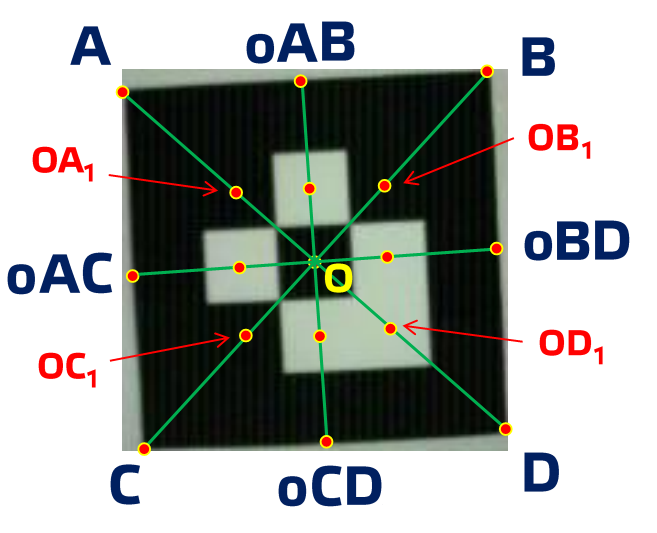

# ARtag markers decoder

This project provides an example of decoding 3x3 [ARtag markers](https://en.wikipedia.org/wiki/ARTag).

The initial data is obtained as an array of points from the camera. The array size is 160x120 points. Point arrays for 4 different markers are presented in text files.

Marker key points are computed by a heuristic algorithm. 

